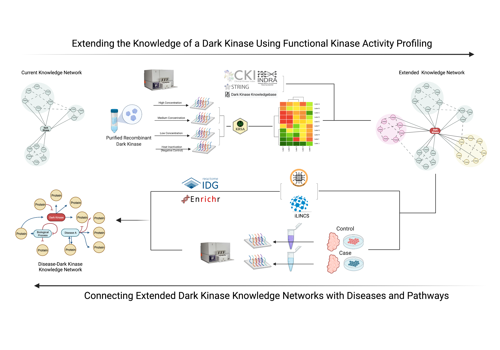

# Dark Kinome

While protein kinases have been a central focus of research for several
decades, a large portion of the kinome is considered understudied or
“dark”. The dark kinome is a consequence of the fact that the majority
of kinase research is dedicated to a subset of kinases with
well-established roles in cellular processes and signaling. A “dark”
status is given to a kinase when a kinase is poorly studied compared to
the rest of kinome. This disparity of knowledge left much of the kinome
untargeted where only less than 10% of kinases are currently targeted by
FDA approved small molecules.

# Workflow

We present a hybrid empirical and in-silico workflow to extend the
functional knowledge of dark kinases. To empirically identify novel
kinase substrates, the PamStation12 (PamGene International B.V.)
platform is utilized to profile purified recombinant kinases.
Additionally, the same platform is used to assess the state of the
active kinome in disease models and deconvolve their kinomic signatures
utilizing the recombinant kinase screening profiles. The in-silico part
of the workflow involves using biological databases and tools to analyze
and visualize functional knowledge of dark kinases by predicatively
connecting them to diseases and pathways.

The Integrated Network and Dynamical Reasoning Assembler (INDRA)
database is a bibliometric knowledge aggregator consisting of unique,
de-duplicated statements of causal biological mechanisms drawn from
natural language processing of PubMed abstracts, PubMedCentral full
texts, and a host of other resources such as Pathway Commons and
BioGRID. INDRA is used to generate reports for some of targets:

[Example INDRA
Report](https://kalganem.github.io/SCZ_Dark_Kinome_Public/INDRA/AATK.html)  
[Example Kaleidoscope
Report](%22https://kalganem.github.io/SCZ_Dark_Kinome_Public/LTK_KS-Report.html%22)
