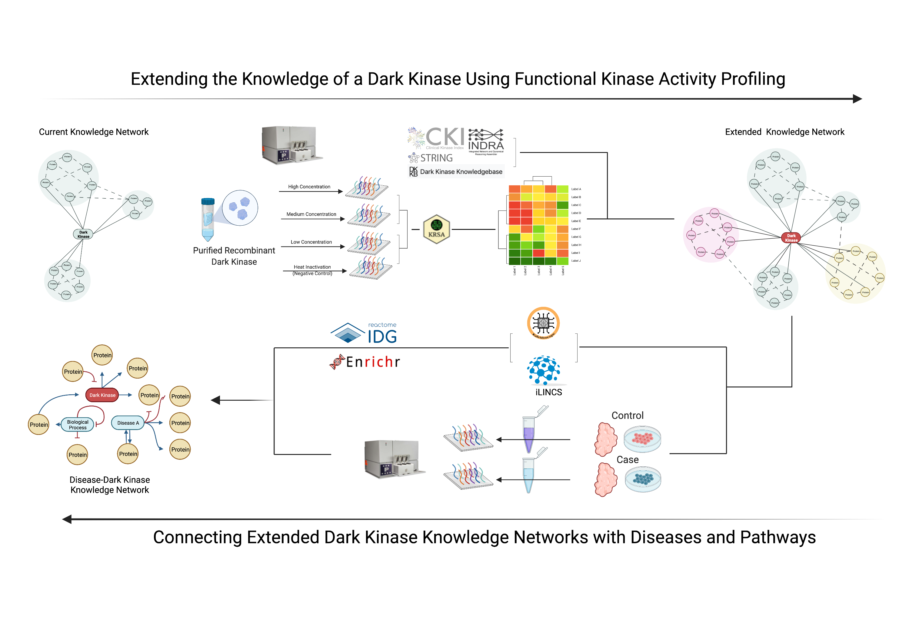

```{r, include = FALSE}
knitr::opts_chunk$set(
  collapse = TRUE,
  comment = "#>",
  fig.path = "man/figures/README-",
  out.width = "100%"
)
```

# Introduction

While protein kinases have been a central focus of research for several decades, a large portion of the kinome is considered understudied or "dark". The dark kinome is a consequence of the fact that the majority of kinase research is dedicated to a subset of kinases with well-established roles in cellular processes and signaling. A "dark" status is given to a kinase when a kinase is poorly studied compared to the rest of kinome. This disparity of knowledge left much of the kinome untargeted where only less than 10% of kinases are currently targeted by FDA approved small molecules.

# Workflow

We present a hybrid empirical and in-silico workflow to extend the functional knowledge of dark kinases. To empirically identify novel kinase substrates, the PamStation12 (PamGene International B.V.) platform is utilized to profile purified recombinant kinases. Additionally, the same platform is used to assess the state of the active kinome in disease models and deconvolve their kinomic signatures utilizing the recombinant kinase screening profiles. The in-silico part of the workflow involves using biological databases and tools to analyze and visualize functional knowledge of dark kinases by predicatively connecting them to diseases and pathways.



The Integrated Network and Dynamical Reasoning Assembler (INDRA) database is a bibliometric knowledge aggregator consisting of unique, de-duplicated statements of causal biological mechanisms drawn from natural language processing of PubMed abstracts, PubMedCentral full texts, and a host of other resources such as Pathway Commons and BioGRID. [INDRA](https://indralab.github.io/) and [Kaleidoscope](https://github.com/CogDisResLab/Kaleidoscope) is used to generate reports for some of targets:

-   [Example INDRA Report](https://kalganem.github.io/SCZ_Dark_Kinome_Public/INDRA/AATK.html)

-   [Example Kaleidoscope Report](https://kalganem.github.io/SCZ_Dark_Kinome_Public/LTK_KS-Report.html)
